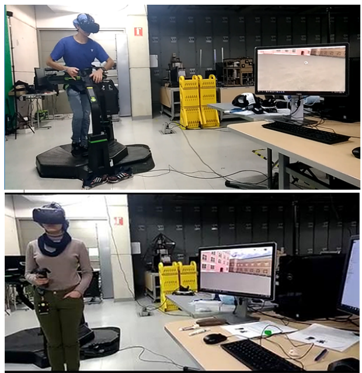
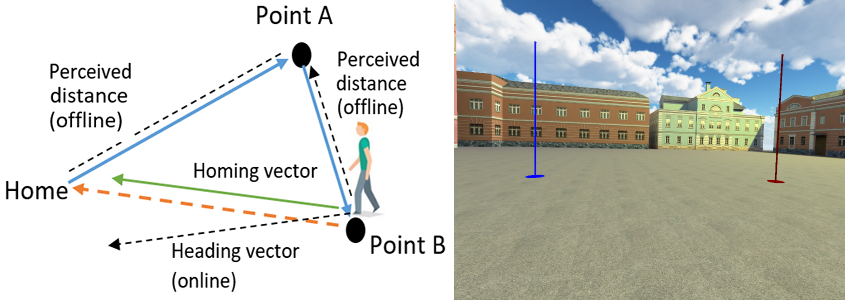

# ViveSpacialPerceptionTests  

ViveSpacialPerceptionTests is a research application designed to study how people perceive space in VR. It is composed of two experimental studies: one focusing on distance perception and another on path integration (the process we use to estimate our position and orientation relative to a known location). Studies have shown that people's perception of space is distorted in virtual environments compared with the physical world. To perceive space, humans use different depth cues that can be classified as visual (binocular disparity, linear perspective, relative size, retinal blur, motion parallax) and oculomotor cues (accommodation, vergence). By analyzing the relationships between our actions and changes in these cues, the visual system develops the basis to perceive the space that surrounds us.

Unfortunately, the harmony of these cues is disrupted in VR. For example, in HMDs, when looking at a virtual object, the eyes accommodate on the screen plane but converge based on the apparent location of the object, causing a conflict in the usual relationship between these cues. As a consequence, the perception of distance is distorted. Additionally, HMDs like the HTC Vive have a smaller field of view compared to our normal vision, which can influence our perception of direction and orientation. Finally, we cannot walk long distances naturally in VR as we do in the physical world, so we use interaction devices like a treadmill or a controller to navigate in the virtual environment, forcing the visual system to recalibrate the action/stimulus patterns.

The study is composed of two tests:

## Distance perception test

To assess the perception of distances, we use a test called blind-walking. Blind-walking is a popular method to assess the perception of distances in VR. In this test, a stimulus is located on the floor at some distance from the subject. The subject is then asked to visualize the stimulus and estimate its distance for a few seconds. Once the subject is confident in their estimation, they must walk toward the location of the stimulus under non-visual conditions. Subjects must estimate the distance of five targets located at 5m, 7.5m, 10m, 12.5m, and 15m using blind-walking tests. They perform this test twice: once using a VR controller and once using a Virtuix Omni Treadmill, a modern VR treadmill that allows omnidirectional walking. This device mimics locomotion by sliding the feet on a slightly concave surface. To prevent bias due to learning effects, two natural-looking scenes are provided: a plaza and a terrace. 

## Path integration test

To assess path integration, we use a test called homing by triangle completion. In this task, the subject is usually guided along two sides of a triangular path while being deprived of external visual cues for the last path. The task is designed to test how well the subject can integrate their movements to estimate their location relative to the starting point. Subjects must estimate where their starting point was while blindfolded and navigating different triangle shapes. Similarly, they perform this test twice: once using a VR controller and once using a Virtuix Omni Treadmill in the two natural-looking scenes.

## Requirements

1. Unity3D version 2017.

2. HTC Vive V1 or Pro.

3. Virtuix Omin Treadmill

3. Nvidia GTX 1060 or later / AMD Radeon RX 480 or later

## Getting Started 

1. Download and install the drivers for the HTC Vive: https://www.vive.com/us/setup/vive-pro-hmd

2. Download and install the Virtuix Omni SDK https://virtuix.com/developers and follow the setup instructions https://www.virtuix.com/uploads/Virtuix%20-%20Omniverse%20Setup%20Instructions%20v2.2.pdf

3. Connect the HTC Vive to your PC, perform the device calibration, and complete the room setup process using SteamVR.

4. Download the project code, there are two scenes 'MainSceneA.scene' and 'MainSceneB', each one contains a different scene in which the test will be performed.

5. Open any of the scenes and execute play, follow the instructions in the headset. 

6. Select the interaction device, either the VR controller or the Virtuix omni treadmill. Then, you must perform first the path integration tests and then the distance perception tests.

7. That's all!. After finishing the test you can find in the folder data, the data of the tests with the user's performace.  

## Paper

More information about this study and its results can be found in https://ieeexplore.ieee.org/document/8798344. 

A video of the experimental setup and protocol can be found here: https://www.youtube.com/watch?v=2cuscqSmRmU

## Credits

Developed by Jose L. Dorado (jl.dorado59@uniandes.edu.co,  jl-dorado@hotmail.com). 

PhD thesis directed by Pablo Figuero (pfiguero@uniandes.edu.co), Jose Tiberio Hernandez (jhernand@uniandes.edu.co), Frederic Merienne (frederic.merienne@ensam.eu), Jean Remmy Chardonnet (jean-remy.chardonnet@ensam.eu)

Copyright 2019 © Grupo Imagine Uniandes
https://imagine.uniandes.edu.co